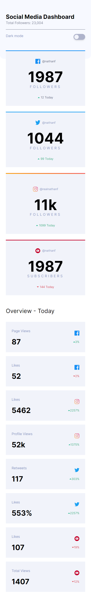
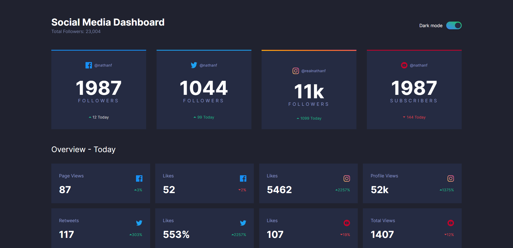
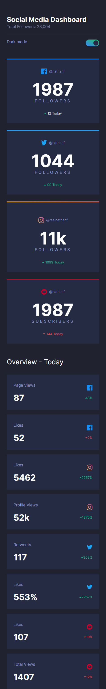

# Frontend Mentor - Social media dashboard with theme switcher solution

This is a solution to the [Social media dashboard with theme switcher challenge on Frontend Mentor](https://www.frontendmentor.io/challenges/social-media-dashboard-with-theme-switcher-6oY8ozp_H). Frontend Mentor challenges help you improve your coding skills by building realistic projects.

## Table of contents

- [Overview](#overview)
  - [The challenge](#the-challenge)
  - [Screenshot](#screenshot)
  - [Links](#links)
- [My process](#my-process)
  - [Built with](#built-with)
  - [What I learned](#what-i-learned)
- [Author](#author)

## Overview

### The challenge

Users should be able to:

- View the optimal layout for the site depending on their device's screen size
- See hover states for all interactive elements on the page
- Toggle color theme to their preference

### Screenshot

- Design for a mobile, desktop with different theme.

### Links

- Live Site URL: [Live site URL here](https://social-media-dashboard-ml4g.onrender.com)

## My process

### Built with

- Semantic HTML5 markup
- CSS custom properties
- Flexbox
- CSS Grid
- Mobile-first workflow
- Javascript
- [Tailwind]() - Tailwind CSS

### What I learned

- How to setup and toggle different themes.

## Author

- Linkedin - [Nika Merabishvili](https://www.linkedin.com/in/nikusha-merabishvili/)
